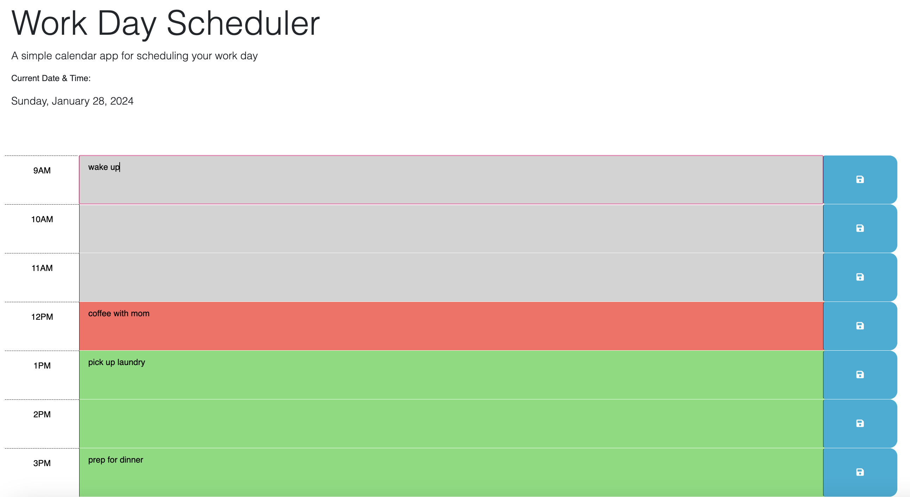

# module-5-challenge
creating a calendar/schedule
# <Third-Party-APIs-Challenge:-Work-Day-Scheduler>

## Description
This project showcases a 9am-5pm work day scheduler. The user should be able to click on either hour of the day to fit their schedule as they wish. The color blocks should indicate the time of day, and the user should be able to write notes within said boxes save their time of day/notes.

# Overview

## Challenge:
Create a simple calendar application that allows a user to save events for each hour of a typical working day (9am–5pm). This app will run in the browser and feature dynamically updated HTML and CSS powered by jQuery.


## User Story
AS AN employee with a busy schedule
I WANT to add important events to a daily planner
SO THAT I can manage my time effectively

## Acceptance Criteria
GIVEN I am using a daily planner to create a schedule
WHEN I open the planner
THEN the current day is displayed at the top of the calendar
WHEN I scroll down
THEN I am presented with time blocks for standard business hours of 9am to 5pm
WHEN I view the time blocks for that day
THEN each time block is color-coded to indicate whether it is in the past, present, or future
WHEN I click into a time block
THEN I can enter an event
WHEN I click the save button for that time block
THEN the text for that event is saved in local storage
WHEN I refresh the page
THEN the saved events persist

# Screenshot/USAGE
  ```md
    
    ```
--
I coded using:

Day.js: https://day.js.org/ 
JQuery: https://jqueryui.com/button/ 

NOTE-- CODE HTML AND CSS IS USED FROM THE STARTER CODE THAT WAS PROVIDED BY INSTRUCTOR.

LICENSE WAS PROVIDED BY: https://choosealicense.com/licenses/mit/# 


## Installation
GITHUB (INSERT REPOSITORY)
https://github.com/isismar3 


## Credits
https://zoom.us/rec/play/tvym6pHQZ4WhCPPYXRAMoGVGEzlIOGkzgwSjJR8b396YpX-mqbUxjZWZNZplHeRnG0XrKef8Z--TzIQt.uvEIe_LvBPyDfhOH?canPlayFromShare=true&from=share_recording_detail&startTime=1652069130000&componentName=rec-play&originRequestUrl=https%3A%2F%2Fzoom.us%2Frec%2Fshare%2FZG4flsxq8gMQobJpek11r-JIXEDXE07HjTme6iAcvSoRbSCj7_jpHVFw0kL9bN5r.hZbvHKioilTXbJpS%3FstartTime%3D1652069130000 (instructors speed run)


## License
MIT License

Copyright (c) [2024] [Isis Martinez]

Permission is hereby granted, free of charge, to any person obtaining a copy
of this software and associated documentation files (the "Software"), to deal
in the Software without restriction, including without limitation the rights
to use, copy, modify, merge, publish, distribute, sublicense, and/or sell
copies of the Software, and to permit persons to whom the Software is
furnished to do so, subject to the following conditions:

The above copyright notice and this permission notice shall be included in all
copies or substantial portions of the Software.

THE SOFTWARE IS PROVIDED "AS IS", WITHOUT WARRANTY OF ANY KIND, EXPRESS OR
IMPLIED, INCLUDING BUT NOT LIMITED TO THE WARRANTIES OF MERCHANTABILITY,
FITNESS FOR A PARTICULAR PURPOSE AND NONINFRINGEMENT. IN NO EVENT SHALL THE
AUTHORS OR COPYRIGHT HOLDERS BE LIABLE FOR ANY CLAIM, DAMAGES OR OTHER
LIABILITY, WHETHER IN AN ACTION OF CONTRACT, TORT OR OTHERWISE, ARISING FROM,
OUT OF OR IN CONNECTION WITH THE SOFTWARE OR THE USE OR OTHER DEALINGS IN THE
SOFTWARE.refer to [https://choosealicense.com/](https://choosealicense.com/).

---